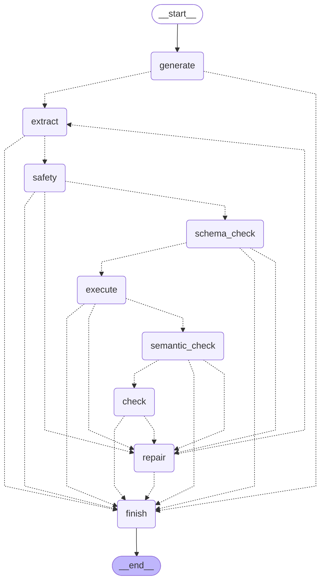

```mermaid
---
config:
  flowchart:
    curve: linear
---
graph TD;
	__start__([<p>__start__</p>]):::first
	generate(generate)
	extract(extract)
	safety(safety)
	schema_check(schema_check)
	execute(execute)
	semantic_check(semantic_check)
	check(check)
	repair(repair)
	finish(finish)
	__end__([<p>__end__</p>]):::last
	__start__ --> generate;
	check -.-> finish;
	check -.-> repair;
	execute -.-> finish;
	execute -.-> repair;
	execute -.-> semantic_check;
	extract -.-> finish;
	extract -.-> safety;
	generate -.-> extract;
	generate -.-> finish;
	repair -.-> extract;
	repair -.-> finish;
	safety -.-> finish;
	safety -.-> repair;
	safety -.-> schema_check;
	schema_check -.-> execute;
	schema_check -.-> finish;
	schema_check -.-> repair;
	semantic_check -.-> check;
	semantic_check -.-> finish;
	semantic_check -.-> repair;
	finish --> __end__;
	classDef default fill:#f2f0ff,line-height:1.2
	classDef first fill-opacity:0
	classDef last fill:#bfb6fc

```
